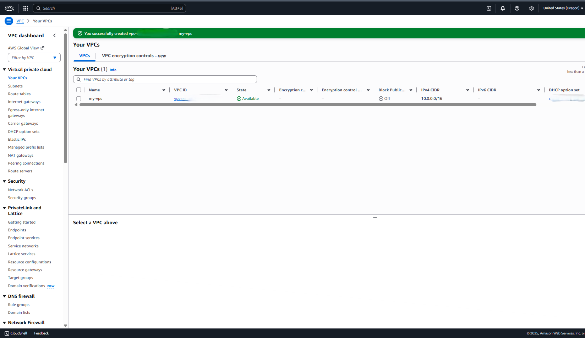
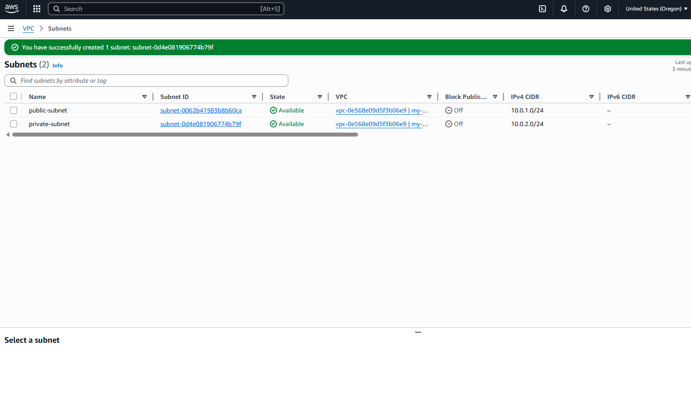
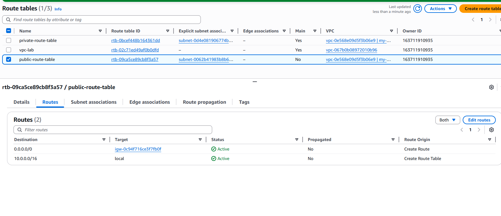
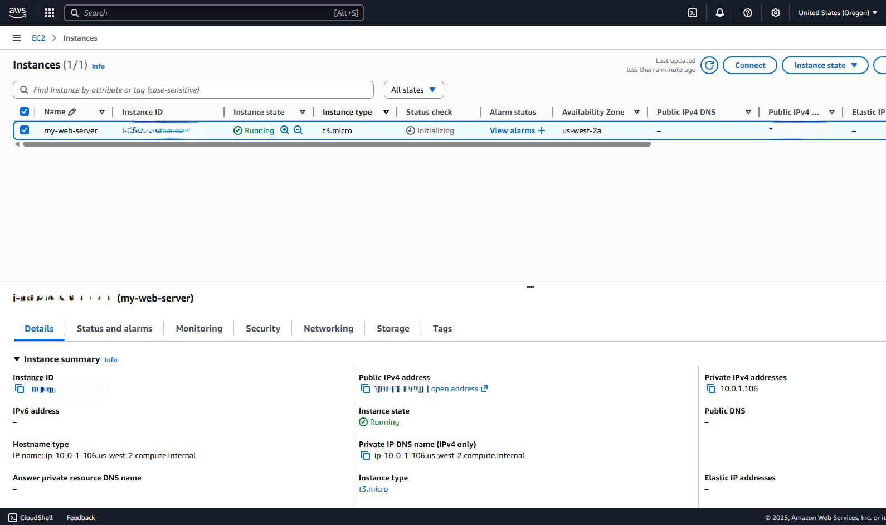
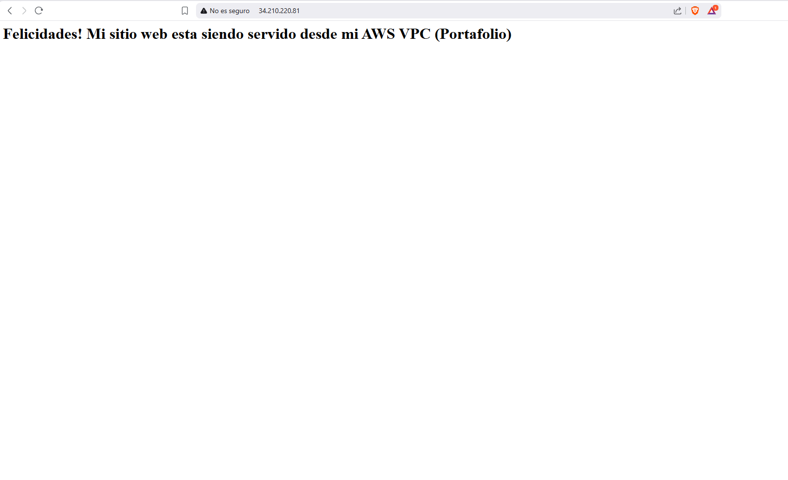

# aws-vpc-ec2-project
AWS project deploying a public EC2 web server inside a custom VPC with public and private subnets.

## **Creación de VPC y conexión de instancia EC2**

Autora: **Patricia Constanza Salas**


**Diagrama**


Este diagrama muestra la configuración de una red virtual privada (VPC) de AWS con conectividad a Internet.

* Se crea una VPC dentro de una Región y se divide en una Subnet Pública y una Subnet Privada.

*	El servidor principal (Amazon EC2) está en la Subnet Pública para ser accesible desde Internet.

*	El Internet Gateway (IGW) y su Tabla de Rutas (0.0.0.0/0) permiten que la instancia EC2 se comunique con el exterior.

*	Un Security Group actúa como firewall para controlar el tráfico permitido.

*	La Subnet Privada queda aislada (sin ruta al IGW), ideal para recursos como bases de datos.
  
Arquitectura estándar de dos niveles para una aplicación web en AWS.


### Paso 1: Crear la Amazon VPC

**Objetivo:** Definir el límite de la red virtual privada y su rango de direcciones IP.

*	Servicio: VPC → Crear VPC

*	Opción: Solo VPC (VPC only)

*	Nombre: my-vpc

*	CIDR IPv4: 10.0.0.0/16 (65.536 IPs, permite crecimiento futuro)

*	Otras opciones: por defecto




### Paso 2: Creación de Subredes (Subnets)

**Objetivo:** Segmentar la VPC en redes públicas y privadas para mayor seguridad.

**Subnet Pública**
*	Nombre: public-subnet
*	CIDR: 10.0.1.0/24
*	Availability Zone: us-west-2a
*	Subnet ID: subnet-xxxxxxxxxxxxxxxx
  
**Subnet Privada**
*	Nombre: private-subnet
*	CIDR: 10.0.2.0/24
*	Availability Zone: us-west-2b
*	Subnet ID: subnet-xxxxxxxxxxxxxxxx
  
Resultado: Dos entornos separados, listos para configurar conectividad a Internet.




### Paso 3: Crear y Adjuntar el Internet Gateway (IGW)

**Objetivo:** Permitir conectividad entre la VPC y la Internet pública.
*	Nombre: my-igw
*	Acción: Adjuntar a la VPC my-vpc
*	Estado: Attached
*	IGW ID: igw-xxxxxxxxxxxxxx


### Paso 4: Configuración de Tablas de Rutas
**Objetivo:** Controlar el tráfico de red para subredes públicas y privadas.

**Tabla Privada (por defecto)**
*	Asociada a la Subnet Privada
*	Solo ruta local
*	Route Table ID: rtb-xxxxxxxxxxxxxxx
  
**Tabla Pública**
*	Nombre: public-route-table
*	Ruta agregada:
    * Destino: 0.0.0.0/0
    * Target: my-igw
*	Subnet asociada: public-subnet
*	Route Table ID: rtb-xxxxxxxxxxxxxx



### Paso 5: Crear el Grupo de Seguridad (Security Group)

**Objetivo:** Definir las reglas de tráfico permitidas hacia la instancia EC2.
*	Nombre: my-security-group
*	VPC: my-vpc
  
**Reglas de Entrada (Inbound)**
*	SSH
	  * Puerto: 22
	  * Origen: My IP
*	HTTP
  	* Puerto: 80
    * Origen: 0.0.0.0/0
**Reglas de Salida (Outbound)**
*	Todo el tráfico permitido (0.0.0.0/0)
*	Security Group ID: sg-xxxxxxxxxxxxxxx


### Paso 6: Lanzamiento de la Instancia EC2

**Objetivo:** Desplegar un servidor web en la Subnet Pública.

*	Nombre: my-web-server
*	AMI: Amazon Linux
*	Tipo: t3.micro
  
**Par de Claves**
*	Tipo: .ppk (compatible con PuTTY en Windows)

**Configuración de Red**
*	VPC: my-vpc
*	Subnet: public-subnet
*	Auto-assign Public IP: Enable
*	Security Group: my-security-group
  
**User Data (script de inicialización)**
```#!/bin/bash
sudo yum update -y
sudo yum install httpd -y
sudo systemctl start httpd
sudo systemctl enable httpd
echo "<h1>Felicidades! Mi sitio web está siendo servido desde mi AWS VPC (Portafolio)</h1>" > /var/www/html/index.html
``` 
*	Instance ID: i-xxxxxxxxxxxxx



### Paso 7: Prueba de Conectividad

**Conexión SSH**

*	Usuario: ec2-user
*	Herramienta: PuTTY
*	Clave: .ppk

```pwd
ls -l /var/www/html
```

**Prueba HTTP**
*	Abrir navegador
*	URL: http://x.x.x.x
Se muestra la página de bienvenida configurada en User Data. 



### Reflexión del Proyecto
**Dificultades y Decisiones de Diseño**
*	Manejo de Route Tables y asociaciones de subredes.
*	Uso de una tabla principal privada para aislamiento.
*	Tabla pública con ruta 0.0.0.0/0 hacia el IGW. 

**Buenas Prácticas Aplicadas**
*	CIDR amplio (10.0.0.0/16) para escalabilidad.
*	Subredes en AZs distintas para alta disponibilidad.
*	Principio de mínimo privilegio en SSH. |
>**Aprendizaje Clave**
El uso de User Data permitió automatizar la instalación y configuración de Apache, demostrando la importancia de la automatización y los principios de Infrastructure as Code (IaC) en AWS.


📝 Derechos de Autor y Licencia

Este proyecto y su documentación están bajo la **Licencia MIT**.

Copyright (c) [2025] **Patricia Constanza Salas**.


